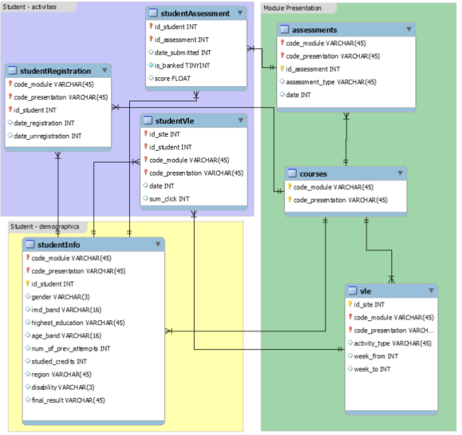

# learnware

This repository contains files for the Learnware machine learning model. The jupyter notebook for our model-building process is at [https://github.com/kurosouza/learnware/blob/master/lop_notebook.ipynb](https://github.com/kurosouza/learnware/blob/master/lop_notebook.ipynb)

You can view the Markdown file containing our first-pass results [here](https://github.com/kurosouza/learnware/blob/master/lop_notebook_1.md)

This project uses the [Open University Learning Analytics Dataset](https://www.kaggle.com/rocki37/open-university-learning-analytics-dataset) compiled by Roxanne Russell. Thanks to him for the amazing work.

## data preprocessing

The dataset has a nicely laid out structure:

###### Image credits: [https://analyse.kmi.open.ac.uk/open_dataset](https://analyse.kmi.open.ac.uk/open_dataset)

Much of the data is contained in the student_vle table and if your data processing environment has strict storage or memory constraints, you may need to trim out some of the data from that table. See the [data preparation notebook](https://github.com/kurosouza/learnware/blob/master/data_preparation.ipynb) for an example on how to do that.

You can send me an email if you have any questions: kurosouza[at]yahoo[dot]com.

Thanks for stopping by!