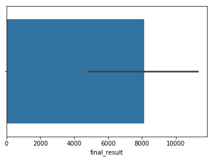
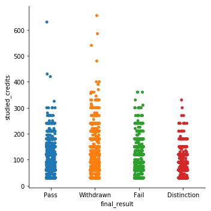
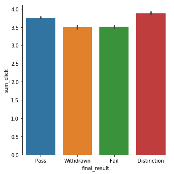
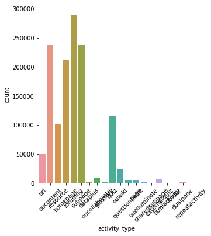

# Predicting student learning performance in a Virtual Learning Environment using activity data


```python
from ibmdbpy import IdaDataBase, IdaDataFrame
import seaborn as sns
import pandas as pd
import numpy as np
```

## A cleaner way to import the data while preserving table names


```python
schema_name = 'LSR68256'
table_names = ['STUDENT_INFO', 'ASSESSMENTS','COURSES','VLE','STUDENT_ASSESSMENT','STUDENT_REGISTRATION','STUDENT_VLE2']
```


```python
idadb_c667f3e30cc04bae88b4ad591071d6b2 = IdaDataBase(dsn='<your DSN here>')
lop_tables = dict()
for table_name in table_names:
    data_df = IdaDataFrame(idadb_c667f3e30cc04bae88b4ad591071d6b2, str.format('{0}.{1}',schema_name,table_name)).as_dataframe()    
    df = pd.DataFrame(data = data_df)
    lop_tables[table_name] = df
```


```python
idadb_c667f3e30cc04bae88b4ad591071d6b2.close()
```

    Connection closed.


```python
lop_tables['STUDENT_INFO'].describe()
```


<div>
<style scoped>
    .dataframe tbody tr th:only-of-type {
        vertical-align: middle;
    }

    .dataframe tbody tr th {
        vertical-align: top;
    }

    .dataframe thead th {
        text-align: right;
    }
</style>
<table border="1" class="dataframe">
  <thead>
    <tr style="text-align: right;">
      <th></th>
      <th>id_student</th>
      <th>num_of_prev_attempts</th>
      <th>studied_credits</th>
    </tr>
  </thead>
  <tbody>
    <tr>
      <th>count</th>
      <td>3.259300e+04</td>
      <td>32593.000000</td>
      <td>32593.000000</td>
    </tr>
    <tr>
      <th>mean</th>
      <td>7.066877e+05</td>
      <td>0.163225</td>
      <td>79.758691</td>
    </tr>
    <tr>
      <th>std</th>
      <td>5.491673e+05</td>
      <td>0.479758</td>
      <td>41.071900</td>
    </tr>
    <tr>
      <th>min</th>
      <td>3.733000e+03</td>
      <td>0.000000</td>
      <td>30.000000</td>
    </tr>
    <tr>
      <th>25%</th>
      <td>5.085730e+05</td>
      <td>0.000000</td>
      <td>60.000000</td>
    </tr>
    <tr>
      <th>50%</th>
      <td>5.903100e+05</td>
      <td>0.000000</td>
      <td>60.000000</td>
    </tr>
    <tr>
      <th>75%</th>
      <td>6.444530e+05</td>
      <td>0.000000</td>
      <td>120.000000</td>
    </tr>
    <tr>
      <th>max</th>
      <td>2.716795e+06</td>
      <td>6.000000</td>
      <td>655.000000</td>
    </tr>
  </tbody>
</table>
</div>


```python
lop_tables['STUDENT_INFO'].info()
```

    <class 'pandas.core.frame.DataFrame'>
    RangeIndex: 32593 entries, 0 to 32592
    Data columns (total 12 columns):
    code_module             32593 non-null object
    code_presentation       32593 non-null object
    id_student              32593 non-null int64
    gender                  32593 non-null object
    region                  32593 non-null object
    highest_education       32593 non-null object
    imd_band                32593 non-null object
    age_band                32593 non-null object
    num_of_prev_attempts    32593 non-null int64
    studied_credits         32593 non-null int64
    disability              32593 non-null object
    final_result            32593 non-null object
    dtypes: int64(3), object(9)
    memory usage: 3.0+ MB


```python
lop_tables['STUDENT_INFO']['final_result'].describe()
```


    count     32593
    unique        4
    top        Pass
    freq      12361
    Name: final_result, dtype: object


```python
lop_tables['STUDENT_INFO']['final_result'].value_counts()
```


    Pass           12361
    Withdrawn      10156
    Fail            7052
    Distinction     3024
    Name: final_result, dtype: int64


```python
sns.barplot(lop_tables['STUDENT_INFO']['final_result'].value_counts())
```


    <matplotlib.axes._subplots.AxesSubplot at 0x7fa753e99358>





```python
lop_tables['STUDENT_INFO'].head()
```


<div>
<style scoped>
    .dataframe tbody tr th:only-of-type {
        vertical-align: middle;
    }

    .dataframe tbody tr th {
        vertical-align: top;
    }

    .dataframe thead th {
        text-align: right;
    }
</style>
<table border="1" class="dataframe">
  <thead>
    <tr style="text-align: right;">
      <th></th>
      <th>code_module</th>
      <th>code_presentation</th>
      <th>id_student</th>
      <th>gender</th>
      <th>region</th>
      <th>highest_education</th>
      <th>imd_band</th>
      <th>age_band</th>
      <th>num_of_prev_attempts</th>
      <th>studied_credits</th>
      <th>disability</th>
      <th>final_result</th>
    </tr>
  </thead>
  <tbody>
    <tr>
      <th>0</th>
      <td>AAA</td>
      <td>2013J</td>
      <td>11391</td>
      <td>M</td>
      <td>East Anglian Region</td>
      <td>HE Qualification</td>
      <td>90-100%</td>
      <td>55&lt;=</td>
      <td>0</td>
      <td>240</td>
      <td>N</td>
      <td>Pass</td>
    </tr>
    <tr>
      <th>1</th>
      <td>AAA</td>
      <td>2013J</td>
      <td>28400</td>
      <td>F</td>
      <td>Scotland</td>
      <td>HE Qualification</td>
      <td>20-30%</td>
      <td>35-55</td>
      <td>0</td>
      <td>60</td>
      <td>N</td>
      <td>Pass</td>
    </tr>
    <tr>
      <th>2</th>
      <td>AAA</td>
      <td>2013J</td>
      <td>30268</td>
      <td>F</td>
      <td>North Western Region</td>
      <td>A Level or Equivalent</td>
      <td>30-40%</td>
      <td>35-55</td>
      <td>0</td>
      <td>60</td>
      <td>Y</td>
      <td>Withdrawn</td>
    </tr>
    <tr>
      <th>3</th>
      <td>AAA</td>
      <td>2013J</td>
      <td>31604</td>
      <td>F</td>
      <td>South East Region</td>
      <td>A Level or Equivalent</td>
      <td>50-60%</td>
      <td>35-55</td>
      <td>0</td>
      <td>60</td>
      <td>N</td>
      <td>Pass</td>
    </tr>
    <tr>
      <th>4</th>
      <td>AAA</td>
      <td>2013J</td>
      <td>32885</td>
      <td>F</td>
      <td>West Midlands Region</td>
      <td>Lower Than A Level</td>
      <td>50-60%</td>
      <td>0-35</td>
      <td>0</td>
      <td>60</td>
      <td>N</td>
      <td>Pass</td>
    </tr>
  </tbody>
</table>
</div>


## Can we use VLE activities to predict a student's final result?


```python
sns.catplot(x = "final_result", y = "studied_credits", data = lop_tables['STUDENT_INFO'])
```


    <seaborn.axisgrid.FacetGrid at 0x7fa76b0b2748>





```python
lop_tables['STUDENT_ASSESSMENT'].head()
```


<div>
<style scoped>
    .dataframe tbody tr th:only-of-type {
        vertical-align: middle;
    }

    .dataframe tbody tr th {
        vertical-align: top;
    }

    .dataframe thead th {
        text-align: right;
    }
</style>
<table border="1" class="dataframe">
  <thead>
    <tr style="text-align: right;">
      <th></th>
      <th>id_assessment</th>
      <th>id_student</th>
      <th>date_submitted</th>
      <th>is_banked</th>
      <th>score</th>
    </tr>
  </thead>
  <tbody>
    <tr>
      <th>0</th>
      <td>1752</td>
      <td>11391</td>
      <td>18</td>
      <td>0</td>
      <td>78</td>
    </tr>
    <tr>
      <th>1</th>
      <td>1752</td>
      <td>28400</td>
      <td>22</td>
      <td>0</td>
      <td>70</td>
    </tr>
    <tr>
      <th>2</th>
      <td>1752</td>
      <td>31604</td>
      <td>17</td>
      <td>0</td>
      <td>72</td>
    </tr>
    <tr>
      <th>3</th>
      <td>1752</td>
      <td>32885</td>
      <td>26</td>
      <td>0</td>
      <td>69</td>
    </tr>
    <tr>
      <th>4</th>
      <td>1752</td>
      <td>38053</td>
      <td>19</td>
      <td>0</td>
      <td>79</td>
    </tr>
  </tbody>
</table>
</div>


```python
lop_tables['STUDENT_ASSESSMENT']['score'].describe()
```


    count     173912
    unique       102
    top          100
    freq       18813
    Name: score, dtype: object


```python
lop_tables['STUDENT_INFO'].info()
```

    <class 'pandas.core.frame.DataFrame'>
    RangeIndex: 32593 entries, 0 to 32592
    Data columns (total 12 columns):
    code_module             32593 non-null object
    code_presentation       32593 non-null object
    id_student              32593 non-null int64
    gender                  32593 non-null object
    region                  32593 non-null object
    highest_education       32593 non-null object
    imd_band                32593 non-null object
    age_band                32593 non-null object
    num_of_prev_attempts    32593 non-null int64
    studied_credits         32593 non-null int64
    disability              32593 non-null object
    final_result            32593 non-null object
    dtypes: int64(3), object(9)
    memory usage: 3.0+ MB


```python
lop_tables['STUDENT_VLE2'].info()
```

    <class 'pandas.core.frame.DataFrame'>
    RangeIndex: 1065858 entries, 0 to 1065857
    Data columns (total 7 columns):
    Column_0             1065858 non-null int64
    code_module          1065858 non-null object
    code_presentation    1065858 non-null object
    id_student           1065858 non-null int64
    id_site              1065858 non-null int64
    date                 1065858 non-null int64
    sum_click            1065858 non-null int64
    dtypes: int64(5), object(2)
    memory usage: 56.9+ MB


## Joining the datasets to merge related data

We use the pandas merge function to join the data from the required dataframes to form one large supertable.


```python
student_full_vle = pd.merge(lop_tables['STUDENT_INFO'], lop_tables['STUDENT_VLE2'], on='id_student', how='inner')
```


```python
student_full_vle_details = pd.merge(student_full_vle, lop_tables['VLE'], on = 'id_site', how = 'inner')
```


```python
student_full_vle.tail()
```


<div>
<style scoped>
    .dataframe tbody tr th:only-of-type {
        vertical-align: middle;
    }

    .dataframe tbody tr th {
        vertical-align: top;
    }

    .dataframe thead th {
        text-align: right;
    }
</style>
<table border="1" class="dataframe">
  <thead>
    <tr style="text-align: right;">
      <th></th>
      <th>code_module_x</th>
      <th>code_presentation_x</th>
      <th>id_student</th>
      <th>gender</th>
      <th>region</th>
      <th>highest_education</th>
      <th>imd_band</th>
      <th>age_band</th>
      <th>num_of_prev_attempts</th>
      <th>studied_credits</th>
      <th>disability</th>
      <th>final_result</th>
      <th>Column_0</th>
      <th>code_module_y</th>
      <th>code_presentation_y</th>
      <th>id_site</th>
      <th>date</th>
      <th>sum_click</th>
    </tr>
  </thead>
  <tbody>
    <tr>
      <th>1301169</th>
      <td>GGG</td>
      <td>2014J</td>
      <td>2684003</td>
      <td>F</td>
      <td>Yorkshire Region</td>
      <td>HE Qualification</td>
      <td>50-60%</td>
      <td>35-55</td>
      <td>0</td>
      <td>30</td>
      <td>N</td>
      <td>Distinction</td>
      <td>1061032</td>
      <td>GGG</td>
      <td>2014J</td>
      <td>897064</td>
      <td>143</td>
      <td>1</td>
    </tr>
    <tr>
      <th>1301170</th>
      <td>GGG</td>
      <td>2014J</td>
      <td>2684003</td>
      <td>F</td>
      <td>Yorkshire Region</td>
      <td>HE Qualification</td>
      <td>50-60%</td>
      <td>35-55</td>
      <td>0</td>
      <td>30</td>
      <td>N</td>
      <td>Distinction</td>
      <td>1061326</td>
      <td>GGG</td>
      <td>2014J</td>
      <td>896943</td>
      <td>149</td>
      <td>6</td>
    </tr>
    <tr>
      <th>1301171</th>
      <td>GGG</td>
      <td>2014J</td>
      <td>2684003</td>
      <td>F</td>
      <td>Yorkshire Region</td>
      <td>HE Qualification</td>
      <td>50-60%</td>
      <td>35-55</td>
      <td>0</td>
      <td>30</td>
      <td>N</td>
      <td>Distinction</td>
      <td>1061729</td>
      <td>GGG</td>
      <td>2014J</td>
      <td>896978</td>
      <td>156</td>
      <td>3</td>
    </tr>
    <tr>
      <th>1301172</th>
      <td>GGG</td>
      <td>2014J</td>
      <td>2684003</td>
      <td>F</td>
      <td>Yorkshire Region</td>
      <td>HE Qualification</td>
      <td>50-60%</td>
      <td>35-55</td>
      <td>0</td>
      <td>30</td>
      <td>N</td>
      <td>Distinction</td>
      <td>1062465</td>
      <td>GGG</td>
      <td>2014J</td>
      <td>896984</td>
      <td>171</td>
      <td>4</td>
    </tr>
    <tr>
      <th>1301173</th>
      <td>GGG</td>
      <td>2014J</td>
      <td>2684003</td>
      <td>F</td>
      <td>Yorkshire Region</td>
      <td>HE Qualification</td>
      <td>50-60%</td>
      <td>35-55</td>
      <td>0</td>
      <td>30</td>
      <td>N</td>
      <td>Distinction</td>
      <td>1064869</td>
      <td>GGG</td>
      <td>2014J</td>
      <td>896943</td>
      <td>219</td>
      <td>1</td>
    </tr>
  </tbody>
</table>
</div>


```python
lop_tables['VLE'].info()
```

    <class 'pandas.core.frame.DataFrame'>
    RangeIndex: 6364 entries, 0 to 6363
    Data columns (total 6 columns):
    id_site              6364 non-null int64
    code_module          6364 non-null object
    code_presentation    6364 non-null object
    activity_type        6364 non-null object
    week_from            6364 non-null object
    week_to              6364 non-null object
    dtypes: int64(1), object(5)
    memory usage: 298.4+ KB


```python
student_full_vle_details.head()
```


<div>
<style scoped>
    .dataframe tbody tr th:only-of-type {
        vertical-align: middle;
    }

    .dataframe tbody tr th {
        vertical-align: top;
    }

    .dataframe thead th {
        text-align: right;
    }
</style>
<table border="1" class="dataframe">
  <thead>
    <tr style="text-align: right;">
      <th></th>
      <th>code_module_x</th>
      <th>code_presentation_x</th>
      <th>id_student</th>
      <th>gender</th>
      <th>region</th>
      <th>highest_education</th>
      <th>imd_band</th>
      <th>age_band</th>
      <th>num_of_prev_attempts</th>
      <th>studied_credits</th>
      <th>...</th>
      <th>code_module_y</th>
      <th>code_presentation_y</th>
      <th>id_site</th>
      <th>date</th>
      <th>sum_click</th>
      <th>code_module</th>
      <th>code_presentation</th>
      <th>activity_type</th>
      <th>week_from</th>
      <th>week_to</th>
    </tr>
  </thead>
  <tbody>
    <tr>
      <th>0</th>
      <td>AAA</td>
      <td>2013J</td>
      <td>11391</td>
      <td>M</td>
      <td>East Anglian Region</td>
      <td>HE Qualification</td>
      <td>90-100%</td>
      <td>55&lt;=</td>
      <td>0</td>
      <td>240</td>
      <td>...</td>
      <td>AAA</td>
      <td>2013J</td>
      <td>546900</td>
      <td>1</td>
      <td>1</td>
      <td>AAA</td>
      <td>2013J</td>
      <td>url</td>
      <td></td>
      <td></td>
    </tr>
    <tr>
      <th>1</th>
      <td>AAA</td>
      <td>2013J</td>
      <td>32885</td>
      <td>F</td>
      <td>West Midlands Region</td>
      <td>Lower Than A Level</td>
      <td>50-60%</td>
      <td>0-35</td>
      <td>0</td>
      <td>60</td>
      <td>...</td>
      <td>AAA</td>
      <td>2013J</td>
      <td>546900</td>
      <td>20</td>
      <td>1</td>
      <td>AAA</td>
      <td>2013J</td>
      <td>url</td>
      <td></td>
      <td></td>
    </tr>
    <tr>
      <th>2</th>
      <td>AAA</td>
      <td>2013J</td>
      <td>32885</td>
      <td>F</td>
      <td>West Midlands Region</td>
      <td>Lower Than A Level</td>
      <td>50-60%</td>
      <td>0-35</td>
      <td>0</td>
      <td>60</td>
      <td>...</td>
      <td>AAA</td>
      <td>2013J</td>
      <td>546900</td>
      <td>23</td>
      <td>1</td>
      <td>AAA</td>
      <td>2013J</td>
      <td>url</td>
      <td></td>
      <td></td>
    </tr>
    <tr>
      <th>3</th>
      <td>AAA</td>
      <td>2013J</td>
      <td>32885</td>
      <td>F</td>
      <td>West Midlands Region</td>
      <td>Lower Than A Level</td>
      <td>50-60%</td>
      <td>0-35</td>
      <td>0</td>
      <td>60</td>
      <td>...</td>
      <td>AAA</td>
      <td>2013J</td>
      <td>546900</td>
      <td>124</td>
      <td>1</td>
      <td>AAA</td>
      <td>2013J</td>
      <td>url</td>
      <td></td>
      <td></td>
    </tr>
    <tr>
      <th>4</th>
      <td>AAA</td>
      <td>2013J</td>
      <td>38053</td>
      <td>M</td>
      <td>Wales</td>
      <td>A Level or Equivalent</td>
      <td>80-90%</td>
      <td>35-55</td>
      <td>0</td>
      <td>60</td>
      <td>...</td>
      <td>AAA</td>
      <td>2013J</td>
      <td>546900</td>
      <td>106</td>
      <td>2</td>
      <td>AAA</td>
      <td>2013J</td>
      <td>url</td>
      <td></td>
      <td></td>
    </tr>
  </tbody>
</table>
<p>5 rows × 23 columns</p>
</div>


Group by id_student and code_module_x + code_presentation_x


```python
student_full_vle_details.info()
```

    <class 'pandas.core.frame.DataFrame'>
    Int64Index: 1301174 entries, 0 to 1301173
    Data columns (total 23 columns):
    code_module_x           1301174 non-null object
    code_presentation_x     1301174 non-null object
    id_student              1301174 non-null int64
    gender                  1301174 non-null object
    region                  1301174 non-null object
    highest_education       1301174 non-null object
    imd_band                1301174 non-null object
    age_band                1301174 non-null object
    num_of_prev_attempts    1301174 non-null int64
    studied_credits         1301174 non-null int64
    disability              1301174 non-null object
    final_result            1301174 non-null object
    Column_0                1301174 non-null int64
    code_module_y           1301174 non-null object
    code_presentation_y     1301174 non-null object
    id_site                 1301174 non-null int64
    date                    1301174 non-null int64
    sum_click               1301174 non-null int64
    code_module             1301174 non-null object
    code_presentation       1301174 non-null object
    activity_type           1301174 non-null object
    week_from               1301174 non-null object
    week_to                 1301174 non-null object
    dtypes: int64(7), object(16)
    memory usage: 238.3+ MB


```python
student_full_vle_details['final_result'] = student_full_vle_details.final_result.astype(str)
```


```python
student_full_vle_details.info()
```

    <class 'pandas.core.frame.DataFrame'>
    Int64Index: 1301174 entries, 0 to 1301173
    Data columns (total 23 columns):
    code_module_x           1301174 non-null object
    code_presentation_x     1301174 non-null object
    id_student              1301174 non-null int64
    gender                  1301174 non-null object
    region                  1301174 non-null object
    highest_education       1301174 non-null object
    imd_band                1301174 non-null object
    age_band                1301174 non-null object
    num_of_prev_attempts    1301174 non-null int64
    studied_credits         1301174 non-null int64
    disability              1301174 non-null object
    final_result            1301174 non-null object
    Column_0                1301174 non-null int64
    code_module_y           1301174 non-null object
    code_presentation_y     1301174 non-null object
    id_site                 1301174 non-null int64
    date                    1301174 non-null int64
    sum_click               1301174 non-null int64
    code_module             1301174 non-null object
    code_presentation       1301174 non-null object
    activity_type           1301174 non-null object
    week_from               1301174 non-null object
    week_to                 1301174 non-null object
    dtypes: int64(7), object(16)
    memory usage: 238.3+ MB


```python
sns.catplot(x = 'final_result', y = 'sum_click', data = student_full_vle_details, kind='bar')
```


    <seaborn.axisgrid.FacetGrid at 0x7fa7647f5358>





```python
plt = sns.catplot(x = 'activity_type', kind = 'count', data = student_full_vle_details)
plt.set_xticklabels(rotation = 45)
```


    <seaborn.axisgrid.FacetGrid at 0x7fa76465f208>





An inspection of the midsection of the dataset


```python
# sns.distplot(student_full_vle_details.activity_type)
student_full_vle_details[500000:500005]
```


<div>
<style scoped>
    .dataframe tbody tr th:only-of-type {
        vertical-align: middle;
    }

    .dataframe tbody tr th {
        vertical-align: top;
    }

    .dataframe thead th {
        text-align: right;
    }
</style>
<table border="1" class="dataframe">
  <thead>
    <tr style="text-align: right;">
      <th></th>
      <th>code_module_x</th>
      <th>code_presentation_x</th>
      <th>id_student</th>
      <th>gender</th>
      <th>region</th>
      <th>highest_education</th>
      <th>imd_band</th>
      <th>age_band</th>
      <th>num_of_prev_attempts</th>
      <th>studied_credits</th>
      <th>...</th>
      <th>code_module_y</th>
      <th>code_presentation_y</th>
      <th>id_site</th>
      <th>date</th>
      <th>sum_click</th>
      <th>code_module</th>
      <th>code_presentation</th>
      <th>activity_type</th>
      <th>week_from</th>
      <th>week_to</th>
    </tr>
  </thead>
  <tbody>
    <tr>
      <th>500000</th>
      <td>CCC</td>
      <td>2014B</td>
      <td>614265</td>
      <td>M</td>
      <td>South Region</td>
      <td>Lower Than A Level</td>
      <td>50-60%</td>
      <td>35-55</td>
      <td>0</td>
      <td>120</td>
      <td>...</td>
      <td>CCC</td>
      <td>2014J</td>
      <td>909013</td>
      <td>96</td>
      <td>1</td>
      <td>CCC</td>
      <td>2014J</td>
      <td>homepage</td>
      <td></td>
      <td></td>
    </tr>
    <tr>
      <th>500001</th>
      <td>CCC</td>
      <td>2014B</td>
      <td>614265</td>
      <td>M</td>
      <td>South Region</td>
      <td>Lower Than A Level</td>
      <td>50-60%</td>
      <td>35-55</td>
      <td>0</td>
      <td>120</td>
      <td>...</td>
      <td>CCC</td>
      <td>2014J</td>
      <td>909013</td>
      <td>234</td>
      <td>2</td>
      <td>CCC</td>
      <td>2014J</td>
      <td>homepage</td>
      <td></td>
      <td></td>
    </tr>
    <tr>
      <th>500002</th>
      <td>CCC</td>
      <td>2014J</td>
      <td>614265</td>
      <td>M</td>
      <td>South Region</td>
      <td>Lower Than A Level</td>
      <td>50-60%</td>
      <td>35-55</td>
      <td>1</td>
      <td>60</td>
      <td>...</td>
      <td>CCC</td>
      <td>2014J</td>
      <td>909013</td>
      <td>1</td>
      <td>9</td>
      <td>CCC</td>
      <td>2014J</td>
      <td>homepage</td>
      <td></td>
      <td></td>
    </tr>
    <tr>
      <th>500003</th>
      <td>CCC</td>
      <td>2014J</td>
      <td>614265</td>
      <td>M</td>
      <td>South Region</td>
      <td>Lower Than A Level</td>
      <td>50-60%</td>
      <td>35-55</td>
      <td>1</td>
      <td>60</td>
      <td>...</td>
      <td>CCC</td>
      <td>2014J</td>
      <td>909013</td>
      <td>9</td>
      <td>2</td>
      <td>CCC</td>
      <td>2014J</td>
      <td>homepage</td>
      <td></td>
      <td></td>
    </tr>
    <tr>
      <th>500004</th>
      <td>CCC</td>
      <td>2014J</td>
      <td>614265</td>
      <td>M</td>
      <td>South Region</td>
      <td>Lower Than A Level</td>
      <td>50-60%</td>
      <td>35-55</td>
      <td>1</td>
      <td>60</td>
      <td>...</td>
      <td>CCC</td>
      <td>2014J</td>
      <td>909013</td>
      <td>72</td>
      <td>1</td>
      <td>CCC</td>
      <td>2014J</td>
      <td>homepage</td>
      <td></td>
      <td></td>
    </tr>
  </tbody>
</table>
<p>5 rows × 23 columns</p>
</div>


Checking for null data in each column


```python
student_full_vle_details.apply(lambda x: sum(x.isnull()), axis=0)
```


    code_module_x           0
    code_presentation_x     0
    id_student              0
    gender                  0
    region                  0
    highest_education       0
    imd_band                0
    age_band                0
    num_of_prev_attempts    0
    studied_credits         0
    disability              0
    final_result            0
    Column_0                0
    code_module_y           0
    code_presentation_y     0
    id_site                 0
    date                    0
    sum_click               0
    code_module             0
    code_presentation       0
    activity_type           0
    week_from               0
    week_to                 0
    dtype: int64


Looks good. Time to encode the categorical data columns:


```python
from sklearn.preprocessing import LabelEncoder


```


```python
cat_feature_names = ['gender', 'region', 'activity_type', 'disability', 'age_band', 'imd_band', 'highest_education', 'code_module', 'code_presentation']
le = LabelEncoder()
for f in cat_feature_names:
    student_full_vle_details[f] = le.fit_transform(student_full_vle_details[f])
student_full_vle_details.dtypes
```


    code_module_x           object
    code_presentation_x     object
    id_student               int64
    gender                   int64
    region                   int64
    highest_education        int64
    imd_band                 int64
    age_band                 int64
    num_of_prev_attempts     int64
    studied_credits          int64
    disability               int64
    final_result            object
    Column_0                 int64
    code_module_y           object
    code_presentation_y     object
    id_site                  int64
    date                     int64
    sum_click                int64
    code_module              int64
    code_presentation        int64
    activity_type            int64
    week_from               object
    week_to                 object
    dtype: object


```python
import numpy as np
```


```python
from sklearn.linear_model import LogisticRegression
from sklearn.model_selection import KFold
from sklearn.ensemble import RandomForestClassifier
from sklearn.tree import DecisionTreeClassifier, export_graphviz
from sklearn import metrics

def classification_model(model, data, predictors, outcome):
    model.fit(data[predictors], data[outcome])
    predictions = model.predict(data[predictors])
    
    accuracy = metrics.accuracy_score(predictions, data[outcome])
    print("Accuracy : %s" % "{0:.3%}".format(accuracy))
    # kf = KFold(data.shape[0],n_splits = 5)    
    kf = KFold(n_splits = 5)
    error = []
    for train, test in kf.split(data):
        train_predictors = (data[predictors].iloc[train, :])
        train_target = data[outcome].iloc[train]
        model.fit(train_predictors, train_target)
        error.append(model.score(data[predictors].iloc[test, :], data[outcome].iloc[test]))
        
    print("Cross validation score : %s" % "{0:.3%}".format(np.mean(error)))
    model.fit(data[predictors], data[outcome])
```


```python
outcome_var = 'final_result'
model = LogisticRegression()
predictor_var = ['id_site','sum_click','activity_type','studied_credits','highest_education']
classification_model(model, student_full_vle_details, predictor_var, outcome_var)
```

    /opt/conda/envs/Python36/lib/python3.6/site-packages/sklearn/linear_model/logistic.py:433: FutureWarning: Default solver will be changed to 'lbfgs' in 0.22. Specify a solver to silence this warning.
      FutureWarning)
    /opt/conda/envs/Python36/lib/python3.6/site-packages/sklearn/linear_model/logistic.py:460: FutureWarning: Default multi_class will be changed to 'auto' in 0.22. Specify the multi_class option to silence this warning.
      "this warning.", FutureWarning)


    Accuracy : 55.111%


    /opt/conda/envs/Python36/lib/python3.6/site-packages/sklearn/linear_model/logistic.py:433: FutureWarning: Default solver will be changed to 'lbfgs' in 0.22. Specify a solver to silence this warning.
      FutureWarning)
    /opt/conda/envs/Python36/lib/python3.6/site-packages/sklearn/linear_model/logistic.py:460: FutureWarning: Default multi_class will be changed to 'auto' in 0.22. Specify the multi_class option to silence this warning.
      "this warning.", FutureWarning)
    /opt/conda/envs/Python36/lib/python3.6/site-packages/sklearn/linear_model/logistic.py:433: FutureWarning: Default solver will be changed to 'lbfgs' in 0.22. Specify a solver to silence this warning.
      FutureWarning)
    /opt/conda/envs/Python36/lib/python3.6/site-packages/sklearn/linear_model/logistic.py:460: FutureWarning: Default multi_class will be changed to 'auto' in 0.22. Specify the multi_class option to silence this warning.
      "this warning.", FutureWarning)
    /opt/conda/envs/Python36/lib/python3.6/site-packages/sklearn/linear_model/logistic.py:433: FutureWarning: Default solver will be changed to 'lbfgs' in 0.22. Specify a solver to silence this warning.
      FutureWarning)
    /opt/conda/envs/Python36/lib/python3.6/site-packages/sklearn/linear_model/logistic.py:460: FutureWarning: Default multi_class will be changed to 'auto' in 0.22. Specify the multi_class option to silence this warning.
      "this warning.", FutureWarning)
    /opt/conda/envs/Python36/lib/python3.6/site-packages/sklearn/linear_model/logistic.py:433: FutureWarning: Default solver will be changed to 'lbfgs' in 0.22. Specify a solver to silence this warning.
      FutureWarning)
    /opt/conda/envs/Python36/lib/python3.6/site-packages/sklearn/linear_model/logistic.py:460: FutureWarning: Default multi_class will be changed to 'auto' in 0.22. Specify the multi_class option to silence this warning.
      "this warning.", FutureWarning)
    /opt/conda/envs/Python36/lib/python3.6/site-packages/sklearn/linear_model/logistic.py:433: FutureWarning: Default solver will be changed to 'lbfgs' in 0.22. Specify a solver to silence this warning.
      FutureWarning)
    /opt/conda/envs/Python36/lib/python3.6/site-packages/sklearn/linear_model/logistic.py:460: FutureWarning: Default multi_class will be changed to 'auto' in 0.22. Specify the multi_class option to silence this warning.
      "this warning.", FutureWarning)


    Cross validation score : 55.111%


    /opt/conda/envs/Python36/lib/python3.6/site-packages/sklearn/linear_model/logistic.py:433: FutureWarning: Default solver will be changed to 'lbfgs' in 0.22. Specify a solver to silence this warning.
      FutureWarning)
    /opt/conda/envs/Python36/lib/python3.6/site-packages/sklearn/linear_model/logistic.py:460: FutureWarning: Default multi_class will be changed to 'auto' in 0.22. Specify the multi_class option to silence this warning.
      "this warning.", FutureWarning)


```python
model = DecisionTreeClassifier()
classification_model(model, student_full_vle_details, predictor_var, outcome_var)
```

    Accuracy : 62.913%
    Cross validation score : 47.154%


```python
model = RandomForestClassifier(n_estimators=100)
predictor_var = ['imd_band', 'age_band', 'num_of_prev_attempts','studied_credits','code_module','code_presentation','activity_type','sum_click','id_site']
classification_model(model, student_full_vle_details, predictor_var, outcome_var)

```

    Accuracy : 74.874%
    Cross validation score : 55.259%


```python
model = RandomForestClassifier(n_estimators=30, max_depth=5)
classification_model(model, student_full_vle_details, predictor_var, outcome_var)
```

    Accuracy : 55.157%
    Cross validation score : 55.133%


```python

```
